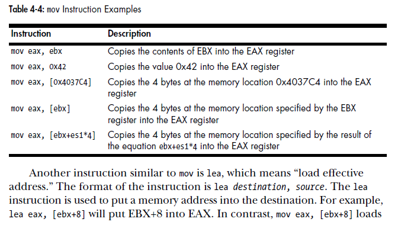
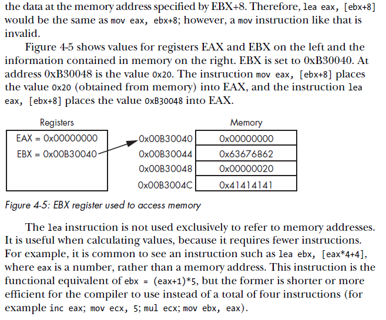
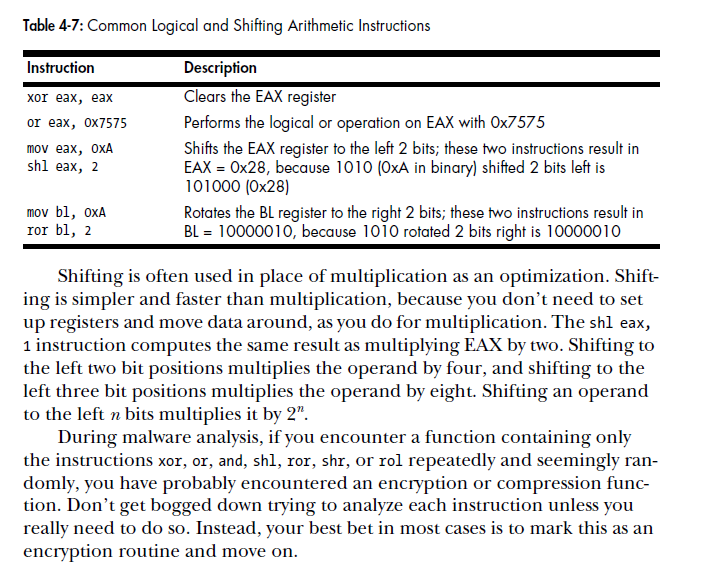
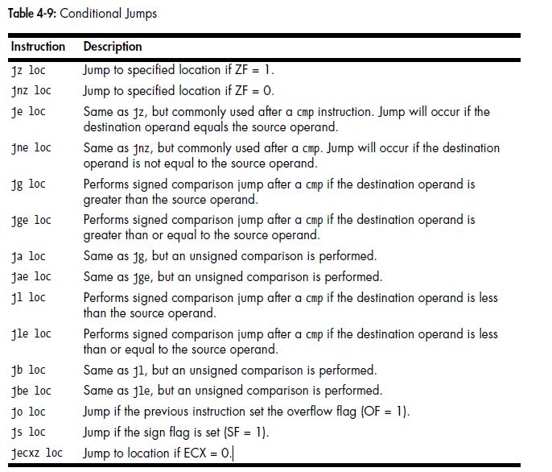

# Assembly

#### Shifting Instructions

#### Conditional Jumps

<u>LEA (Load Effective Address) instruction</u> is a way of obtaining the address which arises from any of the Intel processor's memory addressing modes. it moves the contents of the designated memory location into the target register.