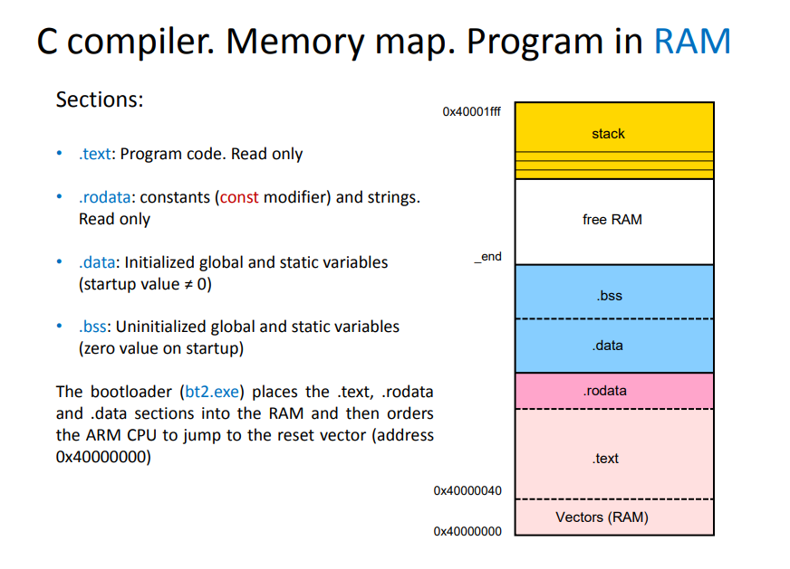
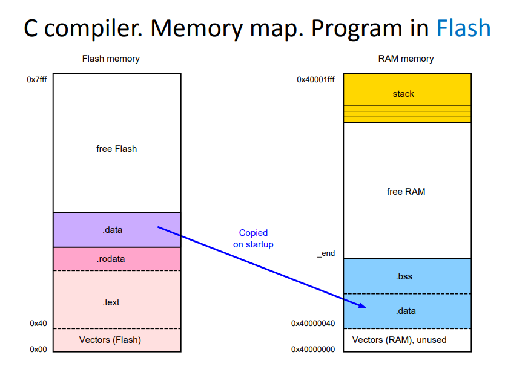
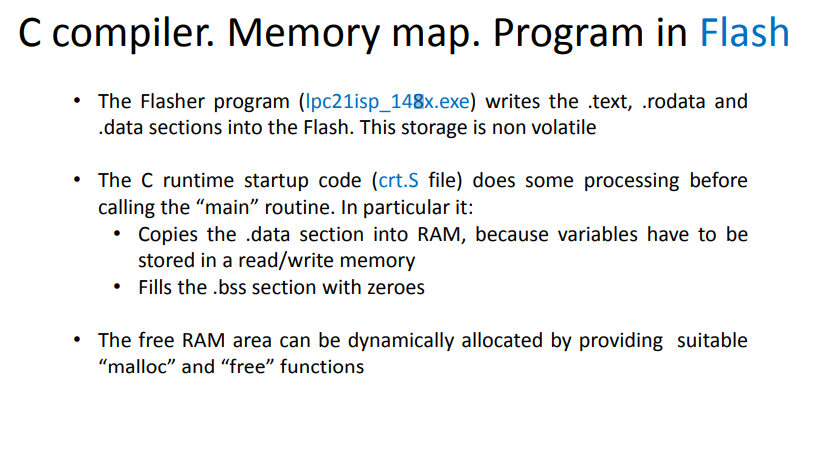

# C Concepts

### Memory Map of a C Program









LibC functions are wrappers around syscalls (fopen is just a syscall open)


## Pointers 101

There are a few important operations, which we will do with the help of pointers very frequently. **(a)** We define a pointer variable, **(b)** assign the address of a variable to a pointer and **(c)** finally access the value at the address available in the pointer variable. This is done by using unary operator ***** that returns the value of the variable located at the address specified by its operand. The following example makes use of these operations −

```c
#include <stdio.h>

int main () {

   int  var = 20;   /* actual variable declaration */
   int  *ip;        /* pointer variable declaration */

   ip = &var;  /* store address of var in pointer variable*/

   printf("Address of var variable: %x\n", &var  );

   /* address stored in pointer variable */
   printf("Address stored in ip variable: %x\n", ip );

   /* access the value using the pointer */
   printf("Value of *ip variable: %d\n", *ip );

   return 0;
}
```

When the above code is compiled and executed, it produces the following result −

```bash
Address of var variable: bffd8b3c
Address stored in ip variable: bffd8b3c
Value of *ip variable: 20
```


### Vulnerable C Functions

- gets()

  - The gets() function cannot be used securely. Because of its lack of bounds checking, and the inability for the calling program to reliably determine the length of the next incoming line, the use of this function enables malicious users to arbitrarily change a running program’s functionality through a buffer overflow attack.

  - **<u>Fix</u>**: fgets()

    

- strcpy() & stpcpy()

  - The strcpy() function is easily misused in a manner which enables malicious users to arbitrarily change a running program’s functionality through a buffer overflow attack.

  - **<u>Fix</u>**: The stpncpy() and strncpy() functions copy at most len characters from src into dst. If src is less than len characters long, the remainder of dst is filled with `\0' characters. Otherwise, dst is not terminated. 

    

- strcat() and strcmp()

  - The strcat() function is easily misused in a manner which enables malicious users to arbitrarily change a running program’s functionality through a buffer overflow attack.

  - **<u>fix</u>**: strncat() or strlcat() and ensure that no more characters are copied to the destination buffer than it can hold. Note that strncat() can also be problematic. It may be a security concern for a string to be truncated at all. Since the truncated string will not be as long as the original, it may refer to a completely different resource and usage of the truncated resource could result in very incorrect behaviour.

    

- sprintf()

  - The sprintf() and vsprintf() functions are easily misused in a manner which enables malicious users to arbitrarily change a running program’s functionality through a buffer overflow attack. Because sprintf() and vsprintf() assume an infinitely long string, callers must be careful not to overflow the actual space; this is often hard to assure.

  - **<u>fix</u>**: snprintf()

    

- printf() and Uncontrolled format string

  - Uncontrolled format string is a vulnerability category which can cause information leakage and overwriting of memory. The following functions are also vulnerable: printf, fprintf, sprintf and snprintf. Also look at other functions that take a “format string” as argument.
  - **<u>fix</u>**: Always hardcode the format string. At least, never let it come directly from any user’s input.