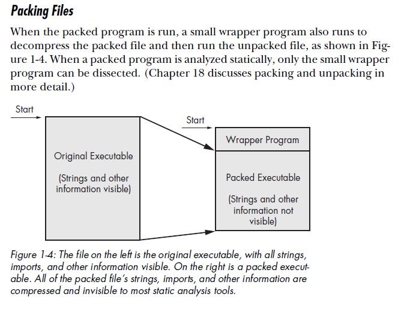
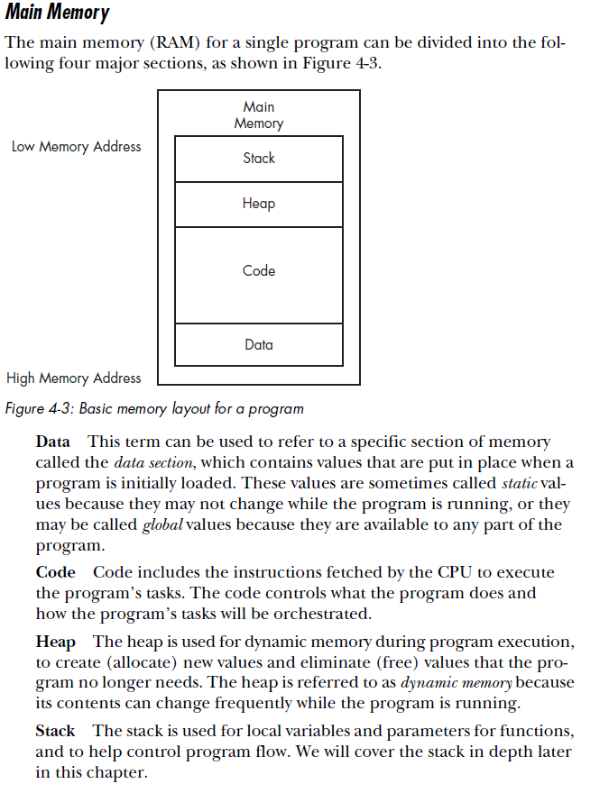

# Reverse Engineering

**<u>Downloading Ghidra for Linux:</u>** 

```bash
wget https://ghidra-sre.org/ghidra_9.1.2_PUBLIC_20200212.zip
unzip ghidra_9.1.2_PUBLIC_20200212.zip
sudo apt install openjdk-11-jdk
cd ghidra_9.1.2_PUBLIC/
./ghidraRun
```


## C, ROP, Hardware Concepts

Everything related to C reverse engineering [here](./C_Concepts/c.md)

Return Oriented Programming (ROP) [here](./ROP/rop.md)

Hardware [here](./hardware/hardware.md)


## Tools & Techniques

**Quick Commands:**

```bash
#for anything embedded
foremost [file]
binwalk -dd ".*" [file]
binwalk -e [file]
#architecture
binwalk -A 

#more RE commands
checksec [file]
strings [file]
rabin2 -zzq [file]
strace [file]
#for tracing library calls
ltrace [file]
objdump [file]
```


## CPU, Memory, Architectures & Assembly Instructions

For indepth Assembly instruction breakdown [here](./Assembly/assembly.md)

- ​	comparison of [hello world between architectures](./Assembly/assembly.md#what-hello-world-looks-like)

<u>ARM & MIPS</u> [<u>here</u>](./Assembly/arm.md)

<u>x86</u> Concepts [here](./x86/x86.md)

<u>x64</u> Concepts [here](./x64/x64.md)

*<u>x86</u>* – 8 general purpose registers. x86 supports the concept of privilege separation through an abstraction called ring level. The processor supports four ring levels, numbered from 0 to 3. (Rings 1 and 2 are not commonly used so they are not discussed here.) Ring 0 is the highest privilege level and can modify all system settings. Ring 3 is the lowest privileged level and can only read/modify a subset of system settings.

<u>*x86-64*</u> – 16 general purpose registers

*<u>Arm</u>* – 16 registers 32-bit general-purpose registers, numbered
R0, R1, R2, . . . , R15. While all of them are available to the application programmer,
in practice the first 12 registers are for general-purpose usage (such as
EAX, EBX, etc., in x86) and the last three have special meaning in the architecture, RISC CPU, encoded in 4 bytes

*<u>Hex</u>* = 0..9 + A..F, each hex digit is 4 bits, prepended with 0x, or h added to end

*<u>Binary</u>* = prepended with 0b, or b added to end

*<u>Octal</u>* = 0..7 mapped to 3 bits, think chmod

<u>*thunk function*</u>: Wrapper function with a single role: call another function. The
simplest way to understand it as adaptors or convertors of one type of jack to another.
For example, an adaptor allowing the insertion of a British power plug into
an American wall socket, or vice-versa. Thunk functions are also sometimes called
wrappers.






## Windows Specific RE

Windows specific RE [here](./Windows/windows.md)


## Mobile

RE for iOS **<u>[here](./ios/ios.md)</u>**

RE for Android **<u>[here](./android/android.md)</u>**


## Example Walkthroughs

RTOS: [Belkin F9K1001](https://github.com/a-rey/reverse_engineering/blob/master/F9K1001/F9K1001_v5_03.21.md) (special thanks to A-Rey)

Using ROP/PwnTools against a [gets ctf](./x64/gcc_elf/gets_ctf.md)