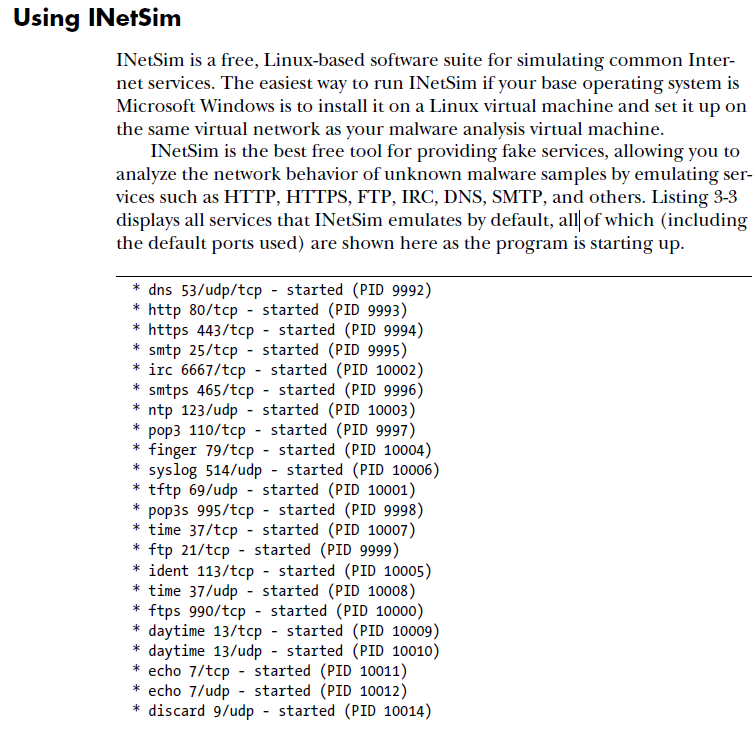
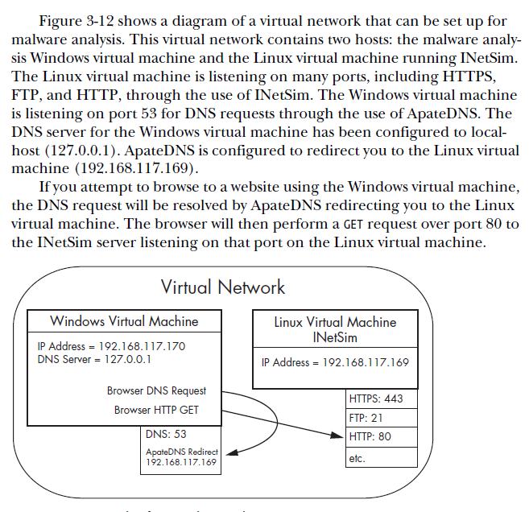

# Reverse Engineering

**<u>Downloading Ghidra for Linux:</u>** 

```bash
wget https://ghidra-sre.org/ghidra_9.1.2_PUBLIC_20200212.zip
unzip ghidra_9.1.2_PUBLIC_20200212.zip
sudo apt install openjdk-11-jdk
cd ghidra_9.1.2_PUBLIC/
./ghidraRun
```


## C, x86, x64, ROP, RTOS Concepts

Everything related to C reverse engineering [here](./C_Concepts/c.md)

x86 Concepts [here](./x86/x86.md)

x64 concepts [here](./x64/x64.md)

Return Oriented Programming (ROP) [here](./ROP/rop.md)

RTOS [here](./RTOS/rtos.md)

## Tools & Techniques

**Quick Commands:**

```bash
#for anything embedded
foremost [file]
binwalk -dd ".*" [file]
binwalk -e [file]
#architecture
binwalk -A 

#more RE commands
checksec [file]
strings [file]
rabin2 -zzq [file]
strace [file]
#for tracing library calls
ltrace [file]
objdump [file]
```






## CPU, Memory & Assembly Instructions

For indepth Assembly instruction breakdown [here](./Assembly/assembly.md)

<u>X86</u> – 8 general purpose registers

<u>X86-64</u> – 16 general purpose registers

<u>Arm</u> – 16 registers, RISC CPU, encoded in 4 byes

<u>Hex</u> = 0..9 + A..F, each hex digit is 4 bits, prepended with 0x, or h added to end

<u>Binary</u> = prepended with 0b, or b added to end

<u>Octal</u> = 0..7 mapped to 3 bits, think chmod

<u>Stripped</u> means the function names are all going to go missing

<u>Statically linking</u> is going to be a larger file because it needs to include all of the libc in the binary

**<u>ARM:</u>** Return address not saved on stack, saved in link register (LR), BX LR causes execution to jump to that address

ARM uses a loadstore model for memory access. This means data must be moved from memory into registers before being operated on, and only load/store instructions can access memory. On ARM, this translates to the LDR and STR instructions. If you want to increment a 32-bit value at a particular memory address, you must fi rst load the value at that address to a register, increment it, and store it back. In contrast with x86, which allows most instructions to directly operate on data in memory, such a simple operation on ARM would require three instructions (one load, one increment, one store). This may imply that there is more code to read for the reverse engineer, but in practice it does not really matter much once you are used to it.


**<u>MIPS:</u>** $0 to $31 or $V0, $A0, to $RA 

1. The $2 (or $V0) register is used to store the function’s return value. LI stands for “Load Immediate” and is the MIPS equivalent to MOV.
2. we must simply keep in mind that in MIPS, the instruction following a jump or branch instruction is executed before the jump/branch instruction itself.

**<u>ARM and MIPS are RISC architectures (mobile, saves power)</u>**:

1. ARM uses R0 for returning results of functions, MOV copies, does not move

Return 0 = XOR EAX, EAX

In Intel-syntax: <instruction> <destination operand> <source operand>.

In AT&T syntax: <instruction> <source operand> <destination operand>.

There are no Thumb and Thumb-2 modes in ARM64, only ARM, so there are 32-bit instructions only. The Register count is doubled: .2.4 on page 1337. 64-bit register have X- prefixes, while its 32-bit parts—W-.

ARM programs also use the stack for saving return addresses, but differently. As mentioned in “Hello, world!” ( 1.5.3 on page 24), the RA is saved to the LR (link register). If one needs, however, to call another function and use the LR register one more time, its value has to be saved. Usually it is saved in the function prologue.

<u>thunk function</u>: Tiny function with a single role: call another function.

<u>Heap</u>: global variables, free floating memory

<u>LEA (Load Effective Address) instruction</u> is a way of obtaining the address which arises from any of the Intel processor's memory addressing modes. it moves the contents of the designated memory location into the target register.


## Windows Specific RE

Windows specific RE [here](./Windows/windows.md)


## Example Walkthroughs

RTOS: [Belkin F9K1001](https://github.com/a-rey/reverse_engineering/blob/master/F9K1001/F9K1001_v5_03.21.md)