# Return Oriented Programming (ROP)

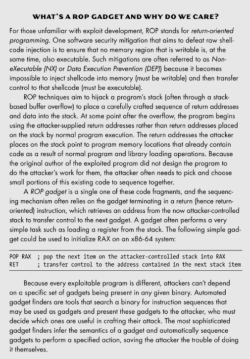


Example Initial findings:

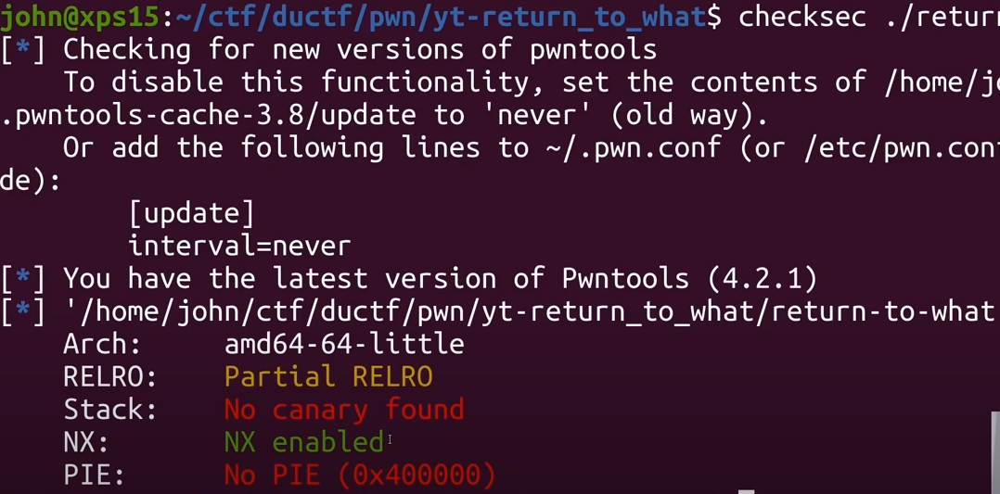

- **NX**: The NX (do not execute) bit is a technology used in CPUs that guarantees that certain memory areas (such as the stack and heap) are not executable, and others, such as the code section, cannot be written. It basically prevents us from using simpler techniques as we did in [this post](https://ironhackers.es/tutoriales/introduccion-al-exploiting-parte-3-mi-primer-buffer-overflow-stack-5-protostar/) where we wrote a shellcode in the stack and then executed it.
- **ASLR:** basically randomizes the base of the libraries (libc) so that we can’t know the memory address of functions of the libc. The ASLR avoids the technique [Ret2libc](https://ironhackers.es/tutoriales/introduccion-al-exploiting-parte-4-ret2libc-stack-6-protostar/) and forces us to have to leak addresses of the same in order to calculate base.
- **PIE:** this technique, like the ASLR, randomizes the base address but in this case it is from the binary itself. This makes it difficult for us to use gadgets or functions of the binary. Since PIE (Position Independent Executable) isn’t enabled we know that the .bss address won’t change from run to run. So, this is a great place to store /bin/sh in memory. Let’s check our section permissions and check our .bss section address (located adjacent to the data segment).
- **Canaries:** Normally, a random value is generated at program initialization, and inserted at the end of the high risk area where the stack overflows, at the end of the function, it is checked whether the canary value has been modified.

More on bypassing each of these **[here](https://ironhackers.es/en/tutoriales/pwn-rop-bypass-nx-aslr-pie-y-canary/)**

<u>Stripped</u> means the function names are all going to go missing

<u>Statically linking</u> is going to be a larger file because it needs to include all of the libc in the binary

**<u>NX Enabled</u>**: This means we can’t just insert shellcode to get execution

We need ROP. Let’s talk a bit about why we need this method. We know we have an executable with DEP/NX enabled so a traditional ret2libc method or traditional buffer overflows where you set RIP to RSP+offset and immediately run your shellcode won’t work. To get around this we use a clever method called Return Oriented Programming (ROP).


**<u>Getting shell for x64</u>**

First, we want to understand how we will be calling our shell. We will do this by using syscall and execve which both take a few arguments, let’s look at syscall first:

```bash
syscall(RAX, RDI, RSI, RDX)
```

**Remember** syscalls are <u>architecture specific</u>. For example, on x86:

```bash
First you push parameters on the stack
Then the syscall number gets moved into EAX (MOV EAX, syscall_number)
Last you invoke the system call with SYSENTER / INT 80
```

The **<u>RAX</u>** (Accumulator register) will hold the system call number where we will call execve (number 59 or **0x3b** in hexadecimal). 

Linux syscall table allows us to also call various other useful functions like socket or _sysctl.

The **<u>RDI</u>** (Destination Index register) argument will point to /bin/sh.

The <u>**RSI and RDX**</u> (Source Index register and Data register) are additional arguments that we will zero out.


<u>**Example writeups that show how to build ROP Chains:**</u>

https://github.com/danny-devv/Building-the-ROP-Chain

Leaking C lib: https://ctftime.org/writeup/23454

John Hammond's tutorial: https://www.youtube.com/watch?v=i5-cWI_HV8o


### Simple ROP Gadget Finder for Ghidra

Our task is to design and develop an instruction analyzer that will identify simple ROP gadgets within a binary. The analyzer needs to be added to Ghidra and be available as a selectable analyzer in the Ghidra Analyzer menu.

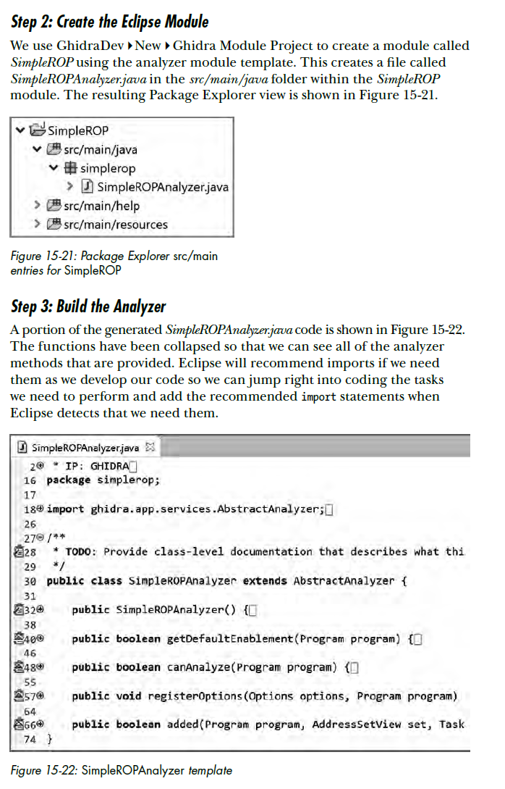

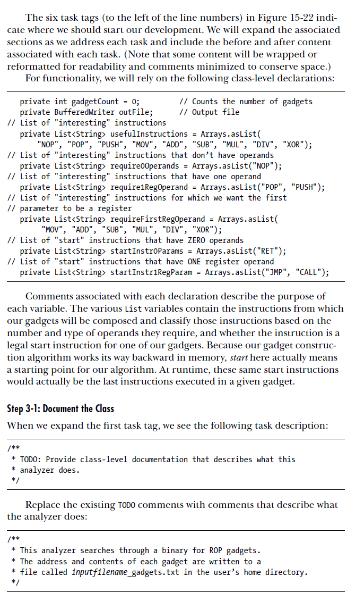

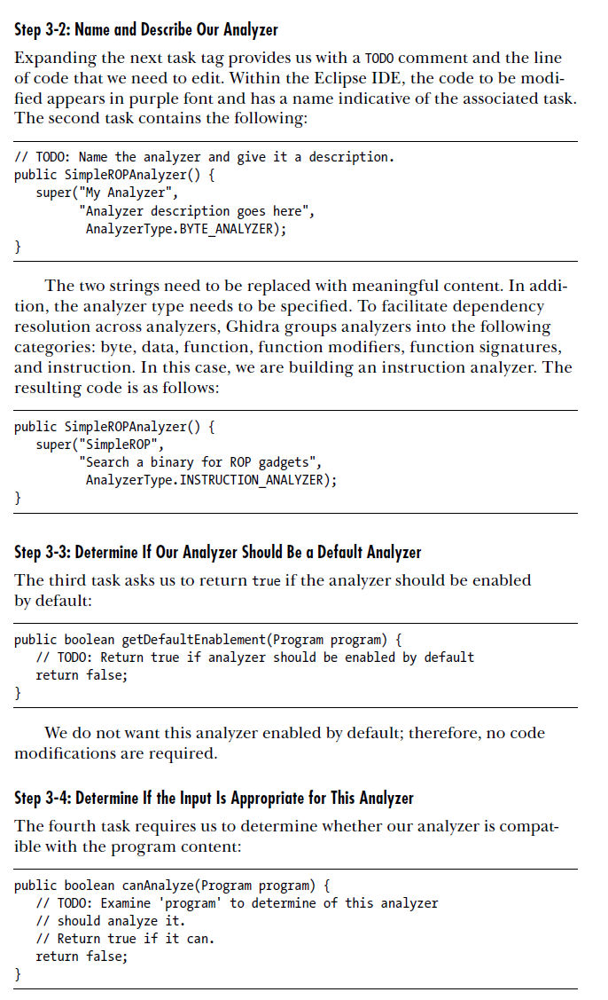

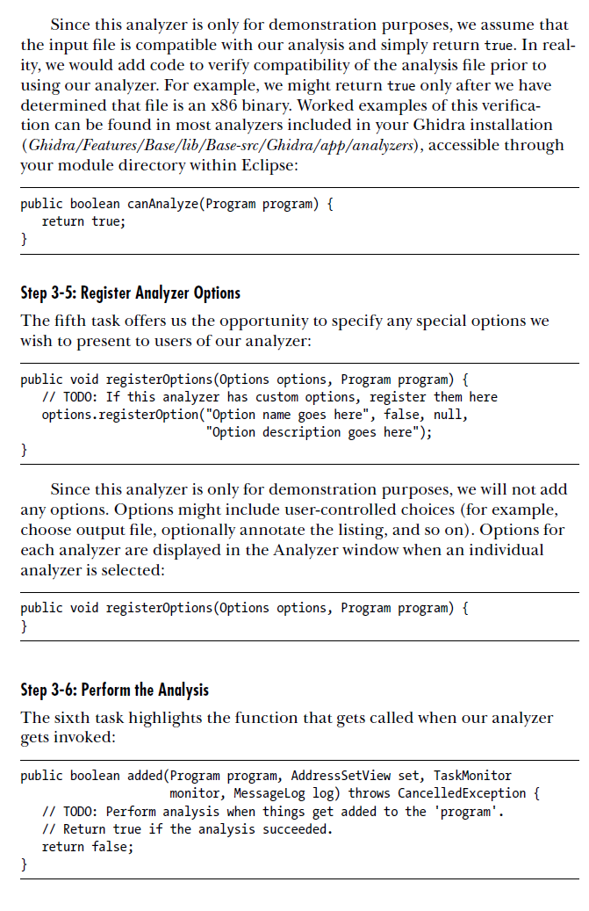

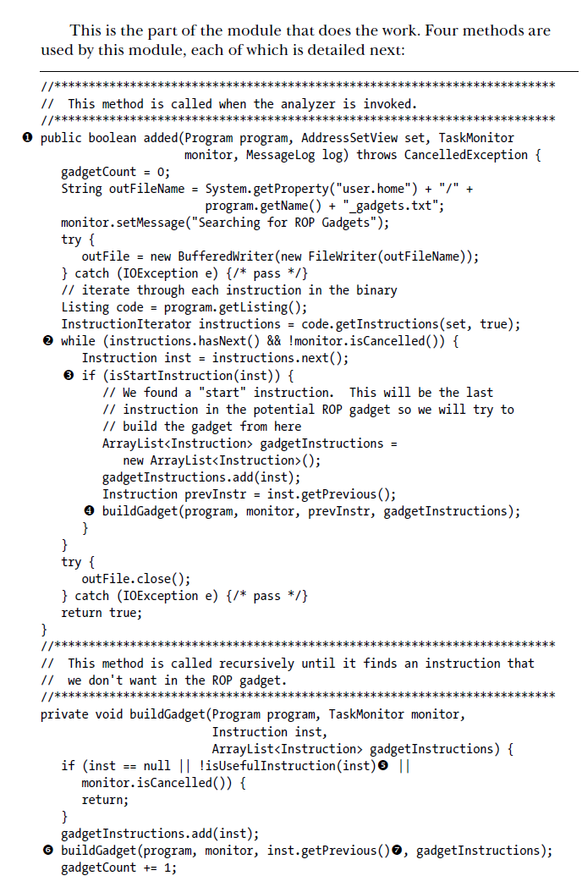

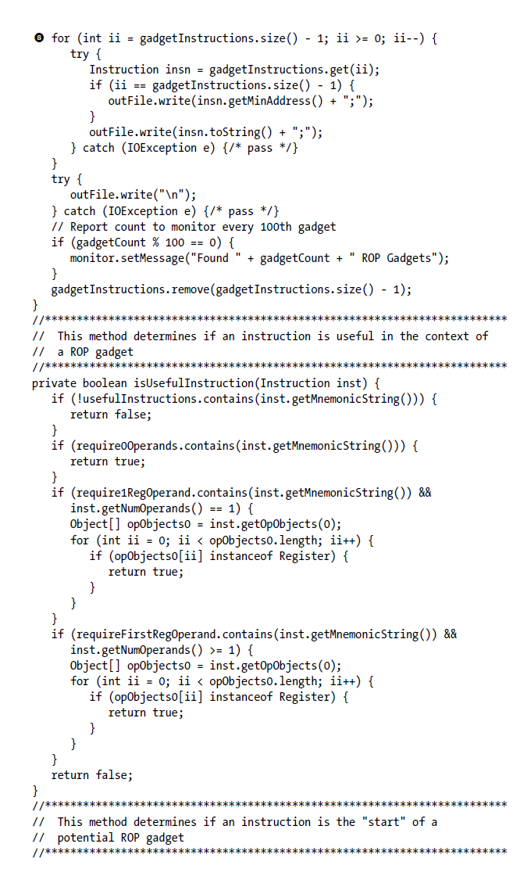

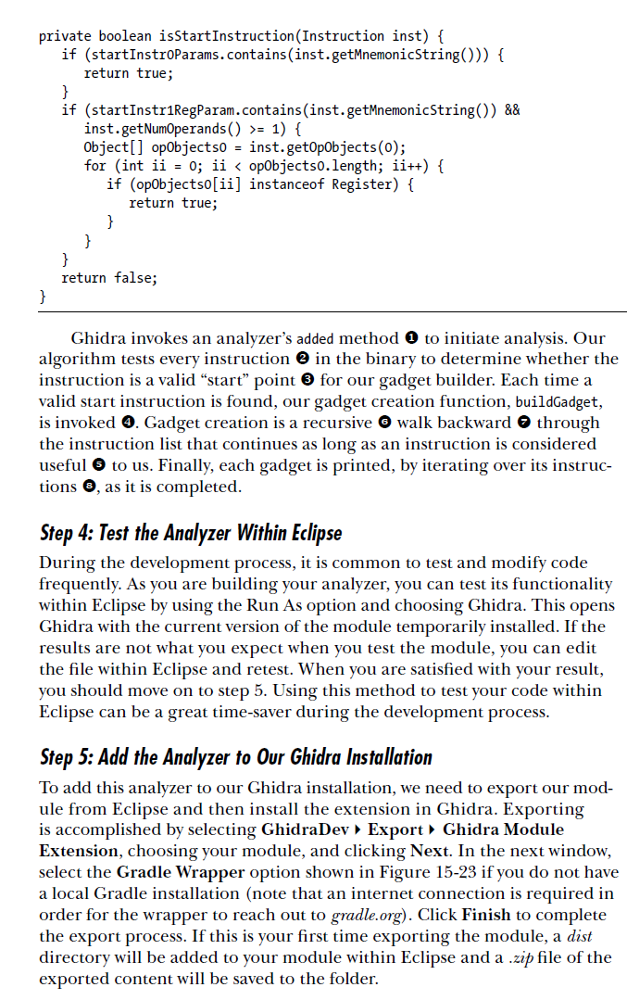

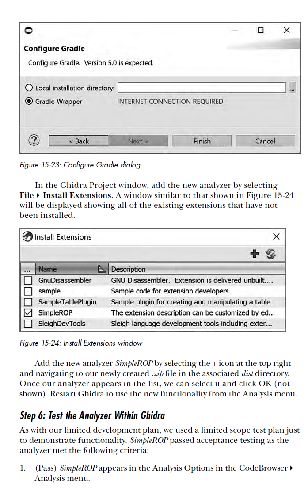

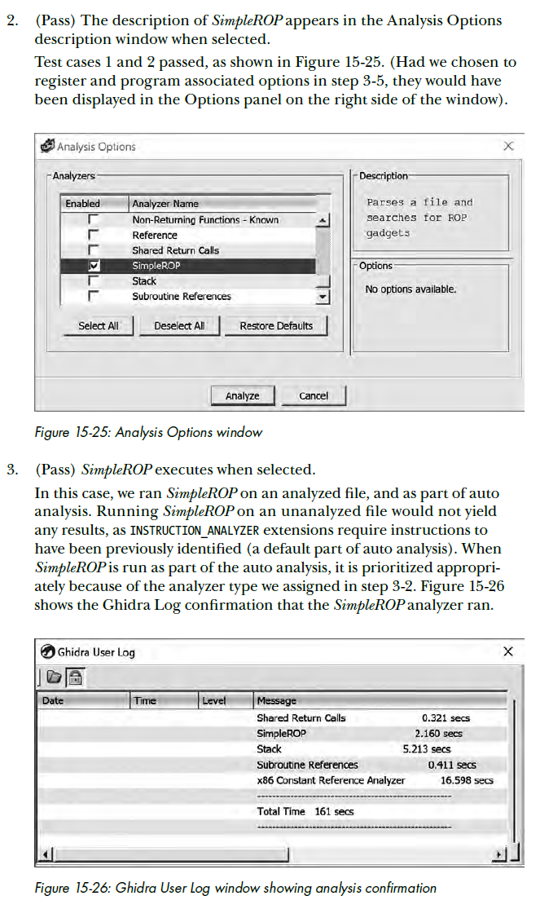

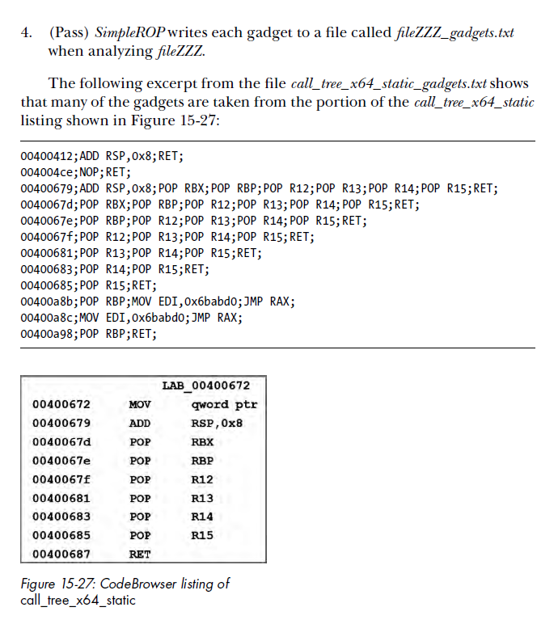

