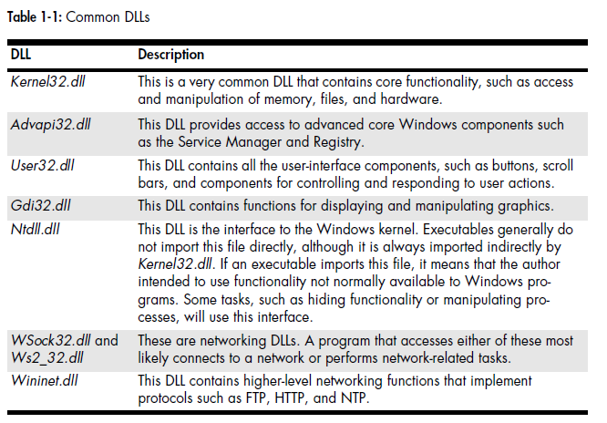
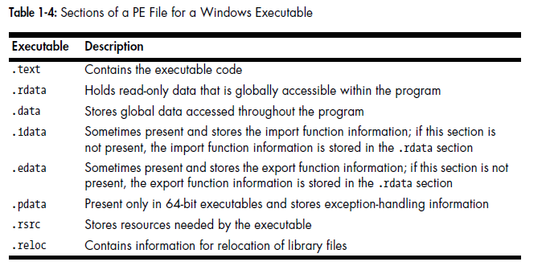

# Windows Specific RE

Packed and obfuscated code will often include at least the functions LoadLibrary and GetProcAddress, which are used to load and gain access to additional functions. The PE file header stores information about every library that will be loaded and every function that will be used by the program.

### Threads, Fibers, Mutexes

The CreateThread function is used to create new threads. The function’s caller specifies a start address, which is often called the start function. Execution begins at the start address and continues until the function returns, although the function does not need to return, and the thread can run until the pro- cess ends. When analyzing code that calls CreateThread, you will need to ana- lyze the start function in addition to analyzing the rest of the code in the function that calls CreateThread.

The caller of CreateThread can specify the function where the thread starts and a single parameter to be passed to the start function. The parameter can be any value, depending on the function where the thread will start. 

Malware can use CreateThread in multiple ways, such as the following: 

- Malware can use CreateThread to load a new malicious library into a process, with CreateThread called and the address of LoadLibrary specified as the start address. (The argument passed to CreateThread is the name of the library to be loaded. The new DLL is loaded into memory in the process, and DllMain is called.) 


- Malware can create two new threads for input and output: one to listen on a socket or pipe and then output that to standard input of a process, and the other to read from standard output and send that to a socket or pipe. The malware’s goal is to send all information to a single socket or pipe in order to communicate seamlessly with the running application. 

  In addition to threads, Microsoft systems use fibers. Fibers *are like threads, but are*  managed by a thread, rather than by the OS. Fibers share a single thread context.  

  

  <u>***Interprocess Coordination with Mutexes***</u>

- One topic related to threads and processes is *mutexes*, referred to as *mutants* when in the kernel. Mutexes are global objects that coordinate multiple pro- cesses and threads.  

- Mutexes are mainly used to control access to shared resources, and are often used by malware. For example, if two threads must access a memory structure, but only one can safely access it at a time, a mutex can be used to control access.  

- Only one thread can own a mutex at a time. Mutexes are important to malware analysis because they often use hard-coded names, which make good host-based indicators. Hard-coded names are common because a mutex’s name must be consistent if it’s used by two processes that aren’t communicating in any other way.  

- The thread gains access to the mutex with a call to WaitForSingleObject, and any subsequent threads attempting to gain access to it must wait. When a thread is finished using a mutex, it uses the ReleaseMutex function.  

  <u>*The Component Object Model*</u>  

- The *Microsoft Component Object Model (COM)* is an interface standard that makes it possible for different software components to call each other’s code without knowledge of specifics about each other. When analyzing malware that uses COM, you’ll need to be able to determine which code will be run as a result of a COM function call.  

- COM works with any programming language and was designed to sup- port reusable software components that could be utilized by all programs. COM uses an object construct that works well with object-oriented program- ming languages, but COM does not work exclusively with object-oriented programming languages.  