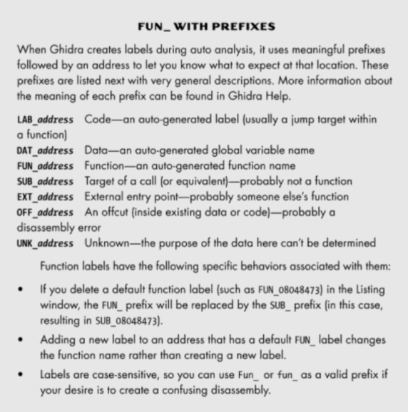

# Ghidra Tips & Tricks

Most of these notes will be from the No Starch Press Ghidra Book

[Hot Keys Cheatsheet](https://ghidra-sre.org/CheatSheet.html)

NSA's [Dev Guide](https://github.com/NationalSecurityAgency/ghidra/blob/master/DevGuide.md)

1. [Custom Function ID](#Custom-Function-IDs)
2. [API](#Common-API-Code)
3. [Modules & P-Code](#Custom-Modules--P-Code)
4. [Headless Execution](#Headless)
5. [Analyzing Unknown Binaries](#Unknown-Binaries)
6. [Emulating for Dynamic Analysis & Deobfuscation](#Emulating-for-Deobfuscation--Dynamic-Analysis)
7. [Patching](#Patching)


### Ghidra's Labels




### Custom Function IDs


### Common API Code

[**<u>Python Examples</u>**](https://github.com/HackOvert/GhidraSnippets)

Check pg. 298 of The Ghidra Book


### Custom Modules & P-Code

Check pg. 322 of The Ghidra Book

Check pg. 415of The Ghidra Book


### Headless

Check pg. 343 of The Ghidra Book

The Headless Analyzer uses the command-line parameters discussed below. See [Examples](https://ghidra.re/ghidra_docs/analyzeHeadlessREADME.html#examples) for common use cases.

```bash
analyzeHeadless <project_location> <project_name>[/<folder_path>] | ghidra://<server>[:<port>]/<repository_name>[/<folder_path>]
        [[-import [<directory>|<file>]+] | [-process [<project_file>]]]
        [-preScript <ScriptName> [<arg>]*]
        [-postScript <ScriptName> [<arg>]*]
        [-scriptPath "<path1>[;<path2>...]"]
        [-propertiesPath "<path1>[;<path2>...]"]
        [-scriptlog <path to script log file>]
        [-log <path to log file>]
        [-overwrite]
        [-recursive]
        [-readOnly]
        [-deleteProject]
        [-noanalysis]
        [-processor <languageID>]
        [-cspec <compilerSpecID>]
        [-analysisTimeoutPerFile <timeout in seconds>]
        [-keystore <KeystorePath>]
        [-connect [<userID>]]
        [-p]
        [-commit ["<comment>"]]
        [-okToDelete]
        [-max-cpu <max cpu cores to use>]
        [-loader <desired loader name>]
```


### Unknown Binaries

Pg. 365 of The Ghidra Book

Ghidra includes loader modules to recognize many of the more common executable and archive file formats, but there is no way that Ghidra can accommodate the ever-increasing number of file formats for storing executable code. Binary images may contain executable files formatted for use with specific operating systems, ROM images extracted from embedded systems, firmware images extracted from flash updates, or simply raw blocks of machine language, perhaps extracted from network packet captures. The format of these images may be dictated by the operating system (executable files), the target processor and system architecture (ROM images), or nothing at all (exploit shellcode embedded in application layer data).

When you are faced with an unrecognized file, arm yourself with as much information about the file as you can get your hands on. Useful resources might include notes on how and where the file was obtained, processor references, operating system references, system design documentation, and any memory layout information obtained through debugging or hardware-assisted analysis (such as via logic analyzers).

Create the memory map


At this point, we would hope that we had enough code to perform a comprehensive analysis of the binary. If we had fewer clues regarding the memory layout of the binary, or the separation between code and data within the file, we would need to rely on other sources of information to guide our analysis. Some potential approaches to determining correct memory layout and locating code include the following:
• Use processor reference manuals to understand where reset vectors may be found.
• Search for strings in the binary that might suggest the architecture, operating system, or compiler used to build the binary.
• Search for common code sequences such as function prologues associated with the processor for which the binary was built.
• Perform statistical analysis over portions of the binary to find regions that look statistically similar to known binaries.
• Look for repetitive data sequences that might be tables of addresses (for example, many nontrivial 32-bit integers that all share the same upper 12 bits).4 These may be pointers and may provide clues regarding the memory layout of the binary.

### Emulating for Deobfuscation & Dynamic Analysis

Pg. 497 of The Ghidra Book

Fortunately, Ghidra provides a rich Emulator class as well as an EmulatorHelper, which provides a higher-level abstraction of common emulator functionality and facilitates the quick-and-easy creation of emulation scripts. In Chapter 18, we introduced p-code as an intermediate representation of the underlying assembly and described how this allows the decompiler to work against a variety of target architectures. Similarly, p-code supports emulator functionality as well, and Ghidra’s ghidra.pcode.emulate.Emulate class provides the ability to emulate a single p-code instruction.
We can use Ghidra’s emulator-related classes to build emulators that allow us to emulate a wide variety of processors. As with other Ghidra packages and classes, this functionality is documented in the Javadoc supplied with Ghidra and can be pulled up as a reference by clicking the red plus tool in the Script Manager window. If you are interested in writing emulators, we encourage you to check out the Javadoc associated with the emulator methods used in the following example.

### Patching

Pg. 523 of The Ghidra Book


