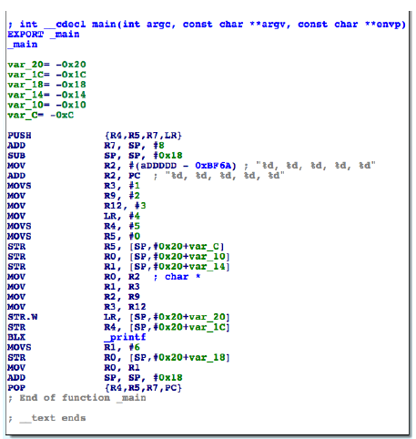

# ARM Rundown	

```bash
R0-R3 Passes arguments and return values
R7 Frame pointer, which points to the previously saved stack frame and the
saved link register
R9 Reserved by system before iOS 3.0
R12 IP register,used by dynamic linker
R13 Stack Pointer, i.e. SP
R14 Link Register, i.e. LR, saves function return address
R15 Program Counter, i.e. PC
```

ARM assembly, there are 4 kinds of conditional branches:

1. The result of operation is zero (or non-zero).
2. The result of operation is negative.
3. The result of operation has carry.
4. The operation overflows (for example, the sum of two positive numbers exceeds 32 bits).


```bash
for:
    add A, #1
    compare A, #16
    bne for // If A - 16 != 0 then jump to for
```


### ARM & Thumb

ARM processors use 2 different instruction sets: ARM and THUMB. The length of ARM
instructions is universally 32 bits, whereas it’s 16 bits for THUMB instructions. Broadly, both sets have 3 kinds of instructions: data processing instructions, register processing instructions, and branch instructions.

<u>**Data processing instructions**</u>

There’re 2 rules in data processing instructions:

1. All operands are 32 bits.
2. All results are 32 bits, and can only be stored in registers.

In a nutshell, the basic syntax of data processing instructions is:

```bash
op{cond}{s} Rd, Rn, Op2
```

“cond” and “s” are two optional suffixes. “cond” decides the execution condition of “op”, and there are 17 conditions:

```bash
EQ The result equals to 0 (EQual to 0)
NE The result doesn’t equal to 0 (Not Equal)
CS The operation has carry or borrow (Carry Set)
HS Same to CS (unsigned Higher or Same)
CC The operation has no carry or borrow (Carry Clear)
LO Same to CC (unsigned LOwer)
MI The result is negative (MInus)
PL The result is greater than or equal to 0 (PLus)
VS The operation overflows (oVerflow Set)
VC The operation doesn’t overflow (oVerflow Clear)
HI If operand1 is unsigned HIgher than operand2
LS If operand1 is unsigned Lower or Same than operand2
GE If operand1 is signed Greater than or Equal to operand2
LT If operand1 is signed Less Than operand2
GT If operand1 is signed Greater Than operand2
LE If operand1 is signed Less
AL ALways,this is the default
```

“cond” is easy to use, for example:

```bash
compare R0, R1
moveGE R2, R0
moveLT R2, R1
```

Compare R0 with R1, if R0 is greater than or equal to R1, then R2 = R0, otherwise R2 = R1. “s” decides whether “op” sets flags or not, there are 4 flags:

```bash
N (Negative)
If the result is negative then assign 1 to N, otherwise assign 0 to N.
Z (Zero)
If the result is zero then assign 1 to Z, otherwise assign 0 to Z.
C (Carry)
For add operations (including CMN), if they have carry then assign 1 to C, otherwise
assign 0 to C; for sub operations (including CMP), Carry acts as Not-Borrow, if borrow
happens then assign 0 to C, otherwise assign 1 to C; for shift operations (excluding add
or sub), assign C the last bit to be shifted out; for the rest of operations, C stays
unchanged.
V (oVerflow)
If the operation overflows then assign 1 to V, otherwise assign 0 to V.
```

One thing to note, C flag works on unsigned calculations, whereas V flag works on signed calculations.

Data processing instructions can be divided into **<u>4 kinds</u>**:

1. Arithmetic instructions

   ```bash
   ADD R0, R1, R2 ; R0 = R1 + R2
   ADC R0, R1, R2 ; R0 = R1 + R2 + C(arry)
   SUB R0, R1, R2 ; R0 = R1 - R2
   SBC R0, R1, R2 ; R0 = R1 - R2 - !C
   RSB R0, R1, R2 ; R0 = R2 - R1
   RSC R0, R1, R2 ; R0 = R2 - R1 - !C
   ```

All arithmetic instructions are based on ADD and SUB. RSB is the abbreviation of “Reverse SuB”, which just reverse the two operands of SUB; instructions ending with “C” stands for ADD with carry or SUB with borrow, and they will assign 1 to C flag when there is carry or there isn’t borrow.

2. Logical operation instructions

   ```bash
   AND R0, R1, R2 ; R0 = R1 & R2
   ORR R0, R1, R2 ; R0 = R1 | R2
   EOR R0, R1, R2 ; R0 = R1 ^ R2
   BIC R0, R1, R2 ; R0 = R1 &~ R2
   MOV R0, R2 ; R0 = R2
   MVN R0, R2 ; R0 = ~R2
   ```

   You may have noticed that there’s no shift instruction, because ARM uses barrel shift with 4 instructions

3. Compare instructions

   ```bash
   CMP R1, R2 ; Set flag according to the result of R1 - R2
   CMN R1, R2 ; Set flag according to the result of R1 + R2
   TST R1, R2 ; Set flag according to the result of R1 & R2
   TEQ R1, R2 ; Set flag according to the result of R1 ^ R2
   ```

   Compare instructions are just arithmetic or logical operation instructions that change flags, but they don’t save the results in registers.

4. Multiply instructions

   ```bash
   MUL R4, R3, R2 ; R4 = R3 * R2
   MLA R4, R3, R2, R1 ; R4 = R3 * R2 + R1
   ```

   The operands of multiply instructions must come from registers.

<u>**Register processing instructions**</u>

The basic syntax of register processing instructions is:

```bash
op{cond}{type} Rd, [Rn, Op2]
```

Rn, the base register, stores base address; the function of “cond” is the same to data processing instructions; “type” decides the data type which “op” operates, there are 4 types:

```bash
B (unsigned Byte)
Extends to 32 bits when executing,filled with 0.

SB (Signed Byte)
For LDR only;extends to 32 bits when executing,filled with the sign bit.

H (unsigned Halfword)
Extends to 32 bits when executing,filled with 0.

SH (Signed Halfword)
For LDR only;extends to 32 bits when executing,filled with the sign bit.
```

The default data type is word if no “type” is specified.

There are only 2 basic register processing instructions: **LDR (LoaD Register)**, which reads data from memory then write to register; and **STR (STore Register)**, which reads data from register then write to memory. They’re used like this:

- LDR

```bash
LDR Rt, [Rn {, #offset}] ; Rt = *(Rn {+ offset}), {} is optional
LDR Rt, [Rn, #offset]! ; Rt = *(Rn + offset); Rn = Rn + offset
LDR Rt, [Rn], #offset ; Rt = *Rn; Rn = Rn + offset
```

- STR

```bash
STR Rt, [Rn {, #offset}] ; *(Rn {+ offset}) = Rt
STR Rt, [Rn, #offset]! ; *(Rn {+ offset}) = Rt; Rn = Rn + offset
STR Rt, [Rn], #offset ; *Rn = Rt; Rn = Rn + offset
```

- LDR or STR two registers at once. The syntax of them is:

```bash
op{cond} Rt, Rt2, [Rn {, #offset}]
```

- The use of LDRD and STRD is just like LDR and STR:

STRD

```bash
STRD R4, R5, [R9,#offset] ; *(R9 + offset) = R4; *(R9 + offset + 4) = R5
```

LDRD

```bash
LDRD R4, R5, [R9,#offset] ; R4 = *(R9 + offset); R5 = *(R9 + offset + 4)
```

Beside LDR and STR, LDM (LoaD Multiple) and STM (STore Multiple) can process several registers at the same time like this:

```bash
op{cond}{mode} Rd{!}, reglist
```

Rd is the base register, and the optional “!” decides whether the modified Rd is written back to the original Rd if “op” modifies Rd; reglist is a list of registers which are curly braced and separated by “,”, or we can use “-” to represent a scope, such as {R4 – R6, R8} stands for R4, R5, R6 and R8; these registers are ordered according to their numbers, regardless of their positions inside the braces.

The function of “cond” is the same to data processing instructions. And, “mode” specifies how Rd is modified, including 4 cases:

```bash
IA (Increment After)
Increment Rd after “op”.
IB (Increment Before)
Increment Rd before “op”.
DA (Decrement After)
Decrement Rd after “op”.
DB (Decrement Before)
Decrement Rd before “op”.
```


<u>**Branch Instructions**</u>

Branch instructions can be divided into **2 kinds**: unconditional branches and conditional branches.

Unconditional branches:

```bash
B Label ; PC = Label
BL Label ; LR = PC – 4; PC = Label
BX Rd ; PC = Rd ,and switch instruction set
```

Unconditional branches are easy to understand, for example:

```bash
foo():
B Label ; Jump to Label to keep executing
....... ; Can’t reach here
Label:
.......
```

Conditional branches:

The “cond” of conditional branches are decided by the 4 flag mentioned in section 6.2.1, their correspondences are:

```bash
cond flag
EQ Z = 1
NE Z = 0
CS C = 1
HS C = 1
CC C = 0
LO C = 0
MI N = 1
PL N = 0
VS V = 1
VC V = 0
HI C = 1 & Z = 0
LS C = 0 | Z = 1
GE N = V
LT N != V
GT Z = 0 & N = V
LE Z = 1 | N != V
```

Before every conditional branch there will be a data processing instruction to set the flag, which determines if the condition is met or not, hence influence the code execution flow.

```bash
Label:
    LDR R0, [R1], #4
    CMP R0, 0 ; If R0 == 0 then Z = 1; else Z = 0
    BNE Label ; If Z == 0 then jump
```


**<u>THUMB Instructions</u>**

THUMB instruction set is a subset of ARM instruction set. Every THUMB instruction is 16 bits long, so THUMB instructions are more space saving than ARM instructions, and can be faster transferred on 16-bit data bus. However, you can’t make an omelet without breaking eggs. All THUMB instructions except “b” can’t be executed conditionally; barrel shift can’t cooperate with other instructions; most THUMB instructions can only make use of registers R0 to R7, etc. Compared with ARM instructions, the features of THUMB instructions are:

- There’re less THUMB instructions than ARM instructions: Since THUMB is just a subset, the number of THUMB instructions is definitely less. For
  example, among all multiply instructions, only MUL is kept in THUMB.
- No conditional execution: Except branch instructions, other instructions cannot be executed conditionally.
- All THUMB instructions set flags by default
- Barrel shift cannot cooperate with other instructions

Shift instructions can only be executed alone, say:

```bash
LSL R0 #2
#but not
ADD R0, R1, LSL #2
```

- Limitation of registers: Unless declared explicitly, THUMB instructions can only make use of R0 to R7. However, there are exceptions: ADD, MOV, and CMP can use R8 to R15 as operands; LDR and STR can use PC or SP; PUSH can use LR, POP can use PC; BX can use all registers.
- Limitation of immediate values and the second operand: Most of THUMB instructions’ formats are “op Rd, Rm”, excluding shift instructions, ADD,
  SUB, MOV and CMP.
- Doesn’t support data write back: All THUMB instructions do not support data write back i.e. “!”, except LDMIA and STMIA.


### Prologue & Epilogues

Prologue

PUSH LR;
PUSH R7;
R7 = SP;
PUSH registers that must be preserved;
Allocates space in the stack frame for local storage.

And Epilogue does the opposite job to Prologue:

Deallocates space that the prolog allocates;
POP preserved registers;
POP R7;
POP LR, and PC = LR.

If the code block doesn’t make use of a register at all, then there is no need to push it onto stack. In iOS reverse engineering, prologs and epilogs may change the value of SP, which deserves our attention.


### Passing Arguments & Return Values

If you want to delve deeper into how arguments and return values are passed, you can read http://infocenter.arm.com/help/topic/com.arm.doc.ihi0042e/IHI0042E_aapcs.pdf. However, in the majority of cases, you just need to remember “sentence of the book”:

<u>“The first 4 arguments are saved in R0, R1, R2 and R3; the rest are saved on the stack; the return value is saved in R0.”</u>

example:

```objective-c
// clang -arch armv7 -isysroot `xcrun --sdk iphoneos --show-sdk-path` -o MainBinary
main.m
#include <stdio.h>
int main(int argc, char **argv)
{
    printf("%d, %d, %d, %d, %d", 1, 2, 3, 4, 5);
    return 6;
}
```

Save this code snippet as main.m, and compile it with the sentence in comments. Then drag and drop MainBinary into IDA and locate to main, as shown



“BLX _printf” calls printf, and its 6 arguments are stored in R0, R1, R2, R3, [SP, #0x20 +
var_20], and [SP, #0x20 + var_1C] respectively; the return value is stored in R0. Because var_20 = -0x20,var_1C = -0x1C, 2 arguments in the stack are at [SP] and [SP, #0x4].