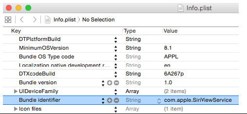

# iOS 

In a nutshell, there are two major functions in iOS reverse engineering:

1. Analyze the target App and get the core information. This can be concluded as security related reverse engineering.
2. Learn from other Apps’ features and then make use of them in our own Apps. This can be concluded as development related reverse engineering.

<u>**System Analysis & Code Analysis:**</u> At the stage of system analysis, we should run target Apps under different conditions, perform various operations, observe the behavioral characteristics and find out features that we are interested in, such as which option we choose leads to a popup alert? Which button makes a sound after pressing it? What is the output associated with our input, etc. Also, we can browse the filesystem, see the displayed images, find the configuration files’ locations, inspect the information stored in databases and check whether the information is encrypted.


### Tools

**<u>Disassemblers:</u>** IDA, Hopper, Class-dump

**<u>Debuggers:</u>** XCode, LLDB

**<u>Dev Kits:</u>** Theos

**<u>Viewing Hierarchy:</u>** Reveal

**<u>File management:</u>** iFunBox, dyld_decache (extracting from dyld_shared_cache)


### Important Directories

iOS comes from OSX, which is based on UNIX. 

As App developers, most of our daily work is dealing with iOS specific directories. Reverse engineering becomes more approachable when it comes to these familiar directories:

- /Applications: Directory for all system Apps and Cydia Apps, excluding StoreApps

- /Developer: files and tools for debugging.

- /Library: contains some system-supported data

- /System/Library: One of the most important directories on iOS, stores lots of system components 

  - /System/Library/Frameworks and /System/Library/PrivateFrameworks
    Stores most iOS frameworks. Documented APIs are only a tiny part of them, while countless private APIs are hidden in those frameworks.
  - /System/Library/CoreServices/SpringBoard.app
    iOS’ graphical user interface, as is explorer to Windows. It is the most important intermediate between users and iOS.

- /User: it’s a symbolic link to /var/mobile

  This directory contains large numbers of user data, such as:

  - Photos are stored in /var/mobile/Media/DCIM
  - Recording files are stored in /var/mobile/Media/Recordings
  - SMS/iMessage databases are stored in /var/mobile/Library/SMS
  - Email data is stored in /var/mobile/Library/Mail
  - /var/mobile/Containers holds StoreApps
  - bundles containing Apps’ executables reside in
    /var/mobile/Containers/Bundle, while Apps’ data files reside in
    /var/mobile/Containers/Data


### Files & Apps

Targets: (1) Application, (2) Dynamic Library (hereafter referred to as dylib) and (3) Daemon binaries.

These 3 kinds of binaries play different roles on iOS, hence have different file hierarchies and permission.

**<u>Bundle</u>**: Bundle is indeed not a single file but a well-organized directory conforming to some standards. It contains the executable binary and all running necessities. Apps and frameworks are packed as bundles.

Frameworks are bundles too, but they contain dylibs instead of executables. Relatively
speaking, frameworks are more important than Apps, because most parts of an App work by calling APIs in frameworks. When you target a bundle in reverse engineering, most of the work can be done inside the bundle, saving you significant time and energy.

**<u>App Directory Hierarchy:</u>** There are 3 important components in an App’s directory:

1. Info.plist: records an App’s basic information, such as its bundle identifier, executable name, icon file name and so forth. We can look up the bundle
   identifier in Info.plist with Xcode:

   

   

   Or use plutil: `plutil -p`

2. Executable: is the core of an App, as well our ultimate reverse engineering target, without doubt. We can locate the executable of an App with Xcode
   Or use plutil: `plutil -p`

3. lproj directories: Localized strings are saved in lproj directories. They are important clues of iOS reverse engineering. plutil tool can also parse those .string files.


##### System Apps & Store Apps

/Applications contains system Apps and Cydia Apps (We treat Cydia Apps as system Apps)

/var/mobile/Containers/Bundle/Application is where StoreApps reside

- **<u>Hierarchy</u>**: Path of their data directory is different, for StoreApps, their data directories are under /var/mobile/Containers/Data, while for system Apps running as mobile, their data directories are under /var/mobile; for system Apps running as root, their data directories are under /var/root.
- **<u>Installation package and permission</u>**: Cydia Apps’ installation packages are .deb formatted while StoreApps’ are .ipa formatted. .deb files come from Debian, and are later ported to iOS. Cydia Apps’ owner and (owner) group are usually root and admin, which enables them to run as root. .ipa is the official App format, whose owner and (owner) group are both mobile, which means they can only run as mobile.
- **<u>Sandbox</u>**: sandbox is a kind of access restriction mechanism, we can see it as a form of permission. Entitlements are also a part of sandbox. Sandbox is one of the core components of iOS security, which possesses a rather complicated implementation, and we’re not going to discuss it in details. Generally, sandbox restricts an App’s file access scope inside the App itself. Most of the time, an App has no idea of the existence of other Apps, not to mention accessing them. What’s more, sandbox restricts an App’s function. For example, an App has to ask for sandbox’s permission to take iCloud related operations.


#### Daemons

Daemons are born to run in the background, providing all kinds of services. For example, imagent guarantees the correct sending and receiving of iMessages, mediaserverd handles almost all audios and videos, and syslogd is used to record system logs. Each daemon consists of two parts, one executable and one plist file. The root process on iOS is launchd, which is also a daemon, checks all plist files under /System/Library/LaunchDaemons and /Library/LaunchDaemons after each reboot, then run the corresponding executable to launch the daemon. A daemons’ plist file plays a similar role as an App’s Info.plist file, it records the daemon’s basic information

use plutil: `plutil -p`

Compared with Apps, daemons provide much much lower level functions, accompanying with much much greater difficulties reverse engineering them. If you don’t know what you’re doing for sure, don’t even try to modify them!


#### Class Dump

Download http://stevenygard.com/projects/class-dump

After downloading and decompressing class-dump-3.5.dmg, copy the class-dump executable to “/usr/bin”, and run “sudo chmod 777 /usr/bin/class-dump” in Terminal to grant it execute permission.

First, copy the target App to OSX, as I placed it under “/Users/snakeninny”. Then go to
App’s directory in Terminal, and use plutil, the Xcode built-in tool to inspect the
“CFBundleExecutable” field in Info.plist:


```bash
cd /Users/snakeninny/SMSNinja.app/

plutil -p Info.plist | grep CFBundleExecutable

class-dump -S -s -H SMSNinja -o
```


#### Theos

Most iOS developers have already installed Xcode, which contains Command Line Tools. For those who don’t have Xcode yet, please download it from Mac AppStore for free. If two or more Xcodes have been installed already, one Xcode should be specified as “active” by “xcodeselect”, Theos will use this Xcode by default. For example, if 3 Xcodes have been installed on your Mac, namely Xcode1.app, Xcode2.app and Xcode3.app, and you want to specify Xcode3 as active, please use the following command:

```bash
sudo xcode-select -s
```

Download:

```bash
export THEOS=/opt/theos
sudo git clone git://github.com/DHowett/theos.git $THEOS
```

Configure ldid

ldid is a tool to sign iOS executables; it replaces codesign from Xcode in jailbreak
development. Download it from http://joedj.net/ldid to “/opt/theos/bin/”, then grant it
execute permission using the following command:

```bash
sudo chmod 777 /opt/theos/bin/ldid
```

Configure CydiaSubstrate

```bash
sudo /opt/theos/bin/bootstrap.sh substrate
```

Configure dpkg-deb

Download dm.pl from
https://raw.githubusercontent.com/DHowett/dm.pl/master/dm.pl, rename it dpkg-deb and move it to “/opt/theos/bin/”, then grant it execute permission using the following command:

```bash
sudo chmod 777 /opt/theos/bin/dpkg-deb
```

Configure Theos NIC templates

It is convenient for us to create various Theos projects because Theos NIC templates have 5 different Theos project templates. You can also get 5 extra templates from
https://github.com/DHowett/theos-nic-templates/archive/master.zip and put the 5 extracted .tar files under “/opt/theos/templates/iphone/”.


**<u>Example Tweak iOSREGreetings Project:</u>**

```bash
#create the project
snakeninnysiMac:Code snakeninny$ /opt/theos/bin/nic.pl
NIC 2.0 - New Instance Creator
------------------------------
[1.] iphone/application
[2.] iphone/cydget
[3.] iphone/framework
[4.] iphone/library
[5.] iphone/notification_center_widget
[6.] iphone/preference_bundle
[7.] iphone/sbsettingstoggle
[8.] iphone/tool
[9.] iphone/tweak
[10.] iphone/xpc_service
Choose a Template (required): 9
Project Name (required): iOSREGreetings
Package Name [com.yourcompany.iosregreetings]: com.iosre.iosregreetings
Author/Maintainer Name [snakeninny]: snakeninny
[iphone/tweak] MobileSubstrate Bundle filter [com.apple.springboard]:
com.apple.springboard
[iphone/tweak] List of applications to terminate upon installation (space-separated, '-'
for none) [SpringBoard]:
Instantiating iphone/tweak in iosregreetings/...
Done.

#edit Tweak.xm
%hook SpringBoard
- (void)applicationDidFinishLaunching:(id)application
{
%orig;
UIAlertView *alert = [[UIAlertView alloc] initWithTitle:@"Come to
http://bbs.iosre.com for more fun!" message:nil delegate:self cancelButtonTitle:@"OK"
otherButtonTitles:nil];
[alert show];
[alert release];
}
%end

#edit makefile 
export THEOS_DEVICE_IP = iOSIP
export ARCHS = armv7 arm64
export TARGET = iphone:clang:latest:8.0
include theos/makefiles/common.mk
TWEAK_NAME = iOSREGreetings
iOSREGreetings_FILES = Tweak.xm
iOSREGreetings_FRAMEWORKS = UIKit
include $(THEOS_MAKE_PATH)/tweak.mk
after-install::
install.exec "killall -9 SpringBoard"

#edit control
Package: com.iosre.iosregreetings
Name: iOSREGreetings
Depends: mobilesubstrate, firmware (>= 8.0)
Version: 1.0
Architecture: iphoneos-arm
Description: Greetings from iOSRE!
Maintainer: snakeninny
Author: snakeninny
Section: Tweaks
Homepage: http://bbs.iosre.com

#compile
make package install
```

