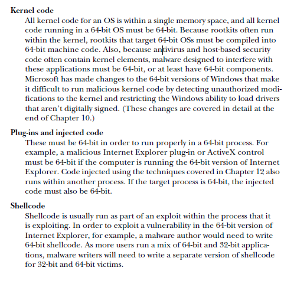
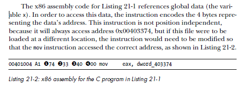
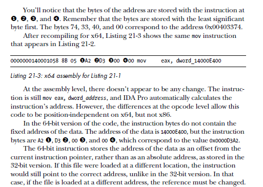

# x64 

**<u>Why 64-Bit Malware?</u>**

Knowing that 32-bit malware can target both 32-bit and 64-bit machines, why
would anyone bother to write 64-bit malware?

While you can run both 32-bit and 64-bit applications on the same system,
you cannot run 32-bit code within 64-bit applications. When a processor is
running 32-bit code, it is running in 32-bit mode, and you cannot run 64-bit
code. Therefore, anytime malware needs to run inside the process space of a
64-bit process, it must be 64-bit.



### Differences in x64 Architecture

The following are the most important differences between Windows 64-bit
and 32-bit architecture:

-  All addresses and pointers are 64 bits.
-  All general-purpose registers—including RAX, RBX, RCX, and so on—
  have increased in size, although the 32-bit versions can still be accessed.
  For example, the RAX register is the 64-bit version of the EAX register.
- Some of the general-purpose registers (RDI, RSI, RBP, and RSP) have
  been extended to support byte accesses, by adding an L suffix to the
  16-bit version. For example, BP normally accesses the lower 16 bits of
  RBP; now, BPL accesses the lowest 8 bits of RBP.
- The special-purpose registers are 64-bits and have been renamed. For
  example, RIP is the 64-bit instruction pointer.
-  There are twice as many general-purpose registers. The new registers
  are labeled R8 though R15. The DWORD (32-bit) versions of these registers
  can be accessed as R8D, R9D, and so on. WORD (16-bit) versions are
  accessed with a W suffix (R8W, R9W, and so on), and byte versions
  are accessed with an L suffix (R8L, R9L, and so on).

x64 also supports instruction pointer–relative data addressing. This is
an important difference between x64 and x86 in relation to PIC and shellcode.
Specifically, in x86 assembly, anytime you want to access data at a
location that is not an offset from a register, the instruction must store the
entire address. This is called absolute addressing. But in x64 assembly, you
can access data at a location that is an offset from the current instruction
pointer. The x64 literature refers to this as RIP-relative addressing.

```c
int x;
void foo() {
int y = x;
...
}
```





Instruction pointer–relative addressing is a powerful addition to the x64
instruction set that significantly decreases the number of addresses that must
be relocated when a DLL is loaded. Instruction pointer–relative addressing
also makes it much easier to write shellcode because it eliminates the need to
obtain a pointer to EIP in order to access data. Unfortunately, this addition
also makes it more difficult to detect shellcode, because it eliminates the
need for a call/pop.


### Differences in the x64 Calling Convention and Stack Usage

The calling convention used by 64-bit Windows is closest to the 32-bit fastcall
calling convention. The first four parameters of the call are passed in the RCX, RDX, R8, and R9 registers; additional ones are stored on the stack.

In the case of 32-bit code, stack space can be allocated and unallocated in
the middle of the function using push and pop instructions. However, in 64-bit
code, functions cannot allocate any space in the middle of the function,
regardless of whether they’re push or other stack-manipulation instructions.

The 32-bit compiler will sometimes generate code that doesn’t change
the stack size in the middle of the function, but 64-bit code never changes the
stack size in the middle of the function. Although this stack restriction is not
enforced by the processor, the Microsoft 64-bit exception-handling model
depends on it in order to function properly. Functions that do not follow this
convention may crash or cause other problems if an exception occurs.

The lack of push and pop instructions in the middle of a function can
make it more difficult for an analyst to determine how many parameters a
function has, because there is no easy way to tell whether a memory address
is being used as a stack variable or as a parameter to a function. There’s also
no way to tell whether a register is being used as a parameter. For example, if
ECX is loaded with a value immediately before a function call, you can’t tell
if the register is loaded as a parameter or for some other reason.

Call to printf compiled for 32 bit processor:

```assembly
004113C0 mov eax, [ebp+arg_0]
004113C3 push eax
004113C4 mov ecx, [ebp+arg_C]
004113C7 push ecx
004113C8 mov edx, [ebp+arg_8]
004113CB push edx
004113CC mov eax, [ebp+arg_4]
004113CF push eax
004113D0 push offset aDDDD_
004113D5 call printf
004113DB add esp, 14h
```

The 32-bit assembly has five push instructions before the call to printf,
and immediately after the call to printf, 0x14 is added to the stack to clean it
up. This clearly indicates that there are five parameters being passed to the
printf function.


Call to printf compiled for 64 bit processor:

```assembly
0000000140002C96 mov ecx, [rsp+38h+arg_0]
0000000140002C9A mov eax, [rsp+38h+arg_0]
0000000140002C9E mov [rsp+38h+var_18], eax
0000000140002CA2 mov r9d, [rsp+38h+arg_18]
0000000140002CA7 mov r8d, [rsp+38h+arg_10]
0000000140002CAC mov edx, [rsp+38h+arg_8]
0000000140002CB0 lea rcx, aDDDD_
0000000140002CB7 call cs:printf
```

In 64-bit disassembly, the number of parameters passed to printf is less
evident. The pattern of load instructions in RCX, RDX, R8, and R9 appears
to show parameters being moved into the registers for the printf function
call, but the mov instruction at `0000000140002C9E` is not as clear.