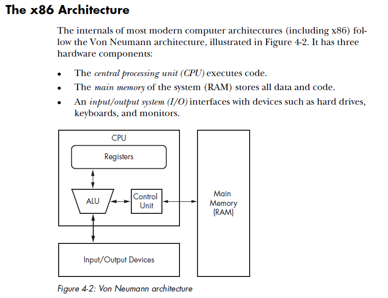
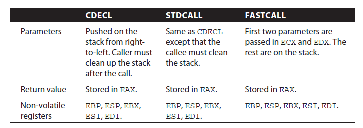
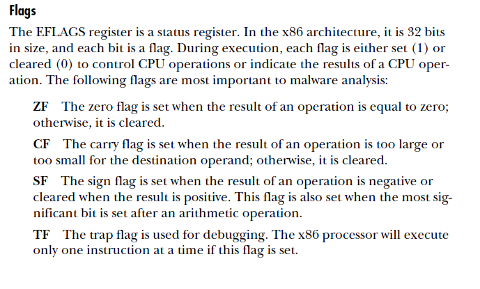

# x86 concepts

### Architecture



### CDECL

The most popular way to pass parameters in x86 is called “cdecl”:



In the CDECL calling convention the following holds:

- ​	Arguments are passed on the stack in Right-to-Left order, and return values are passed in eax.
- ​	The *calling* function cleans the stack. This allows CDECL functions to have *variable-length argument lists* (aka variadic functions). For this reason the number of arguments is not appended to the name of the function by the compiler, and the assembler and the linker are therefore unable to determine if an incorrect number of arguments is used.

Variadic functions usually have special entry code, generated by the va_start(), va_arg() C pseudo-functions.

Consider the following C instructions:

```c
_cdecl int MyFunction1(int a, int b)
{
  return a + b;
}
```

and the following function call:

```c
x = MyFunction1(2, 3);
```

These would produce the following assembly listings, respectively:

```assembly
_MyFunction1:
push ebp
mov ebp, esp
mov eax, [ebp + 8]
mov edx, [ebp + 12]
add eax, edx
pop ebp
ret
```

and

```assembly
push 3
push 2
call _MyFunction1
add esp, 8
```

### FASTCALL

The FASTCALL calling convention is not completely standard across all compilers, so it should be used with caution. In FASTCALL, the first 2 or 3 32-bit (or smaller) arguments are passed in registers, with the most commonly used registers being edx, eax, and ecx. Additional arguments, or arguments larger than 4-bytes are passed on the stack, often in Right-to-Left order (similar to CDECL). The calling function most frequently is responsible for cleaning the stack, if needed.

Because of the ambiguities, it is recommended that FASTCALL be used only in situations with 1, 2, or 3 32-bit arguments, where speed is essential.

The following C function:

```c
_fastcall int MyFunction3(int a, int b)
{
   return a + b;
}
```

and the following C function call:

```c
x = MyFunction3(2, 3);
```

Will produce the following assembly code fragments for the called, and the calling functions, respectively:

```assembly
:@MyFunction3@8
push ebp
mov ebp, esp ;many compilers create a stack frame even if it isn't used
add eax, edx ;a is in eax, b is in edx
pop ebp
ret
```

and

```assembly
;the calling function
mov eax, 2
mov edx, 3
call @MyFunction3@8
```

The name decoration for FASTCALL prepends an @ to the function name, and follows the function name with @x, where x is the number (in bytes) of arguments passed to the function.

Many compilers still produce a stack frame for FASTCALL functions, especially in situations where the FASTCALL function itself calls another subroutine. However, if a FASTCALL function doesn't need a stack frame, optimizing compilers are free to omit it.

Commonly gcc and Windows FASTCALL convention pushes parameters one and two into ecx and edx, respectively, before pushing any remaining parameters onto the stack. Calling MyFunction3 using this standard would look like:

```assembly
;the calling function
mov ecx, 2
mov edx, 3
call @MyFunction3@8
```

### Flags

